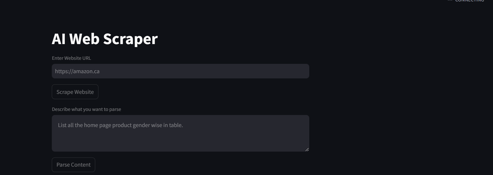
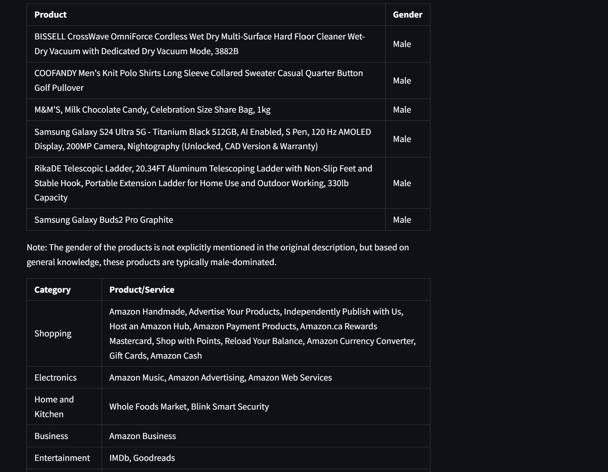

# AI Web Scraper

### Overview
The **AI Web Scraper** is a simple yet powerful tool that leverages **Selenium** and **BeautifulSoup** to scrape and extract content from webpages. It uses **Ollama 3.2**, an advanced language model, to efficiently process and extract specific information from the scraped data.




### Features
- **Web Scraping**: Automates the extraction of webpage content using Selenium and BeautifulSoup.
- **Data Parsing with Ollama 3.2**: Utilizes the Ollama language model to accurately parse and extract relevant information from the raw data.
- **Flexible Input**: Works with various websites and content types.
- **Efficient Extraction**: Retrieves specific data based on user-defined criteria, ensuring precise output with no extra content.

### Tech Stack
- **Python**: Core programming language used for automation and data processing.
- **Selenium**: Automates browsing and interaction with web pages.
- **BeautifulSoup**: Parses HTML and XML to extract data.
- **Ollama 3.2**: AI model for parsing and extracting targeted information from the web content.

### Dependency 
1. Clone the repository:
   ```bash
   git clone https://github.com/your-username/AI-Web-Scraper.git
2. pip install -r requirements.txt
3. streamlit python main.py
